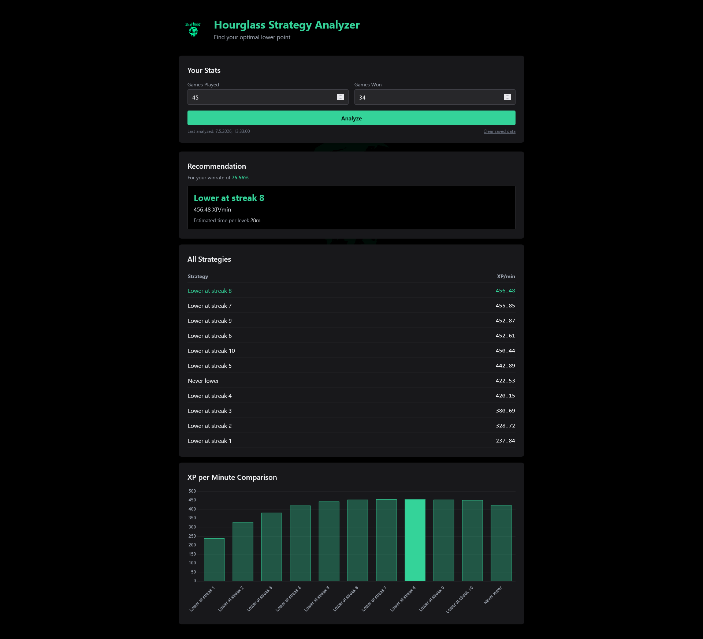

# Hourglass Strategy Analyzer


A web application that helps Sea of Thieves players find their optimal lower point in Hourglass PvP, based on their personal winrate. Uses Monte-Carlo simulation across all viable lowering strategies to determine which one yields the most XP per minute.

## Live Demo

https://hourglass-production-857a.up.railway.app/

## What It Does

The Hourglass Strategy Analyzer answers a specific question: *"Given my current winrate, when is the best time to lower my hourglass to maximize XP gain over time?"*

Instead of guessing or following community heuristics, the app simulates 1,000,000 games per strategy across 11 different lowering thresholds (lower at streak 1 through 10, plus "never lower") and recommends the one that yields the highest expected XP per minute. The simulation accounts for game duration, lowering duration, win/loss outcomes at each streak level, and streak-based XP scaling.

## Features

- Personalized recommendation based on your actual winrate
- Comparison table of all viable lowering strategies, sorted by XP/min
- Visual bar chart highlighting the optimal strategy
- Estimated time per Hourglass level based on the recommended strategy
- Local persistence: inputs and results are saved in your browser between sessions
- Input validation with helpful error messages
- Responsive design that works on desktop and mobile

## Where to Find Your Stats

To use the analyzer, you need two numbers from your in-game profile:

1. Open the **Ship's Log**
2. Navigate to **Milestones** -> **Pirate Milestones**
3. Choose either **The Guardian** or **The Servant** depending on which faction you play
4. **Games Played**: read the value from **Battles Completed**
5. **Games Won**: sum up the values from **Battles Won as Guardian by Seeking a Foe** and **Battles Won as Guardian by Repelling a Foe** (use the equivalent Servant entries if you play the Servant faction)

Enter both values into the analyzer and click "Analyze".

## How It Works

### XP Mechanics

The app uses the following XP values, which apply at level 100 and above (the linear progression range):

| Action                | XP    |
|-----------------------|-------|
| XP per Level          | 12600 |
| Loss                  | 700   |
| Win at Streak 0       | 4200  |
| Win at Streak 1       | 4675  |
| Win at Streak 2       | 5190  |
| Win at Streak 3       | 5688  |
| Win at Streak 4 and above | 6600  |
| Lower at Streak 1     | 1100  |
| Lower at Streak 2     | 2640  |
| Lower at Streak 3     | 4680  |
| Lower at Streak 4     | 7800  |
| Lower at Streak 5+    | 7800 + 3000 * (streak - 4) |

A loss resets your streak to 0. Lowering also resets your streak to 0 but grants the lowering XP bonus instead of the loss penalty.

### Time Assumptions

Each game is assumed to take 10 minutes on average. The lowering action is also assumed to take 10 minutes. These values can be adjusted in `HourglassConstants.java`.

### Simulation Logic

For each candidate strategy (lower at streak X), the app simulates 100,000 games and runs that simulation 10 times to reduce statistical variance. The averaged XP per minute is then compared across all strategies, and the highest is recommended.

## Tech Stack

### Backend
- Java 21
- Spring Boot 4
- Gradle

### Frontend
- HTML, CSS, JavaScript (no framework)
- Tailwind CSS via CDN
- Chart.js for data visualization

### Hosting
- Railway

### Testing
- JUnit 5
- Spring Boot Test (MockMvc, WebMvcTest)

## Run Locally

Requirements: Java 21 or higher.

```bash
git clone https://github.com/HannibalKing94/hourglass.git
cd hourglass
./gradlew bootRun
```

Then open http://localhost:8080 in your browser.

## Run Tests

```bash
./gradlew test
```

The test suite covers the calculator logic (deterministic and statistical tests), the HTTP controller layer (with mocked dependencies), and an end-to-end integration test that boots the full Spring context.

## API

The app exposes a single REST endpoint:

### GET /api/analyze

**Query Parameters:**
- `gamesWon` (integer, required): number of games won
- `gamesPlayed` (integer, required): number of games played

**Success Response (200):**
```json
{
  "winrate": 0.6,
  "allStrategies": [
    { "lowerAtStreak": 5, "xpPerMinute": 337.82 },
    { "lowerAtStreak": 6, "xpPerMinute": 336.88 }
  ],
  "bestStrategy": { "lowerAtStreak": 5, "xpPerMinute": 337.82 }
}
```

A `lowerAtStreak` value of `2147483647` (Integer.MAX_VALUE) represents the "never lower" strategy.

**Error Response (400):**
```json
{
  "message": "Games played must be greater than 0"
}
```

## Credits

This project was inspired by [Sponge's video on Hourglass strategy](https://www.youtube.com/watch?v=mejmQYP-bvU). Check out his [YouTube channel](https://www.youtube.com/@massivesponge).

The XP values used in the simulation are based on data documented by [DavidSOT](https://www.youtube.com/@DavidSOT).

## Disclaimer

This tool is fan-made and not affiliated with Rare or Microsoft. Sea of Thieves is a trademark of Rare Limited. The XP values used in the simulation are based on community-documented mechanics and may change with future game updates. If you notice that the values are out of date, please open an issue.

## License

MIT